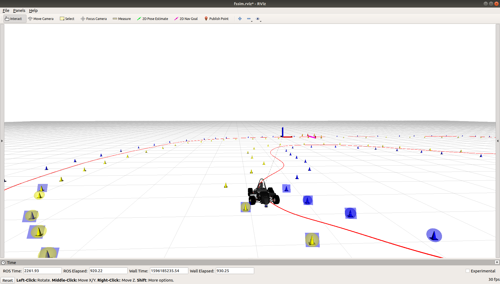
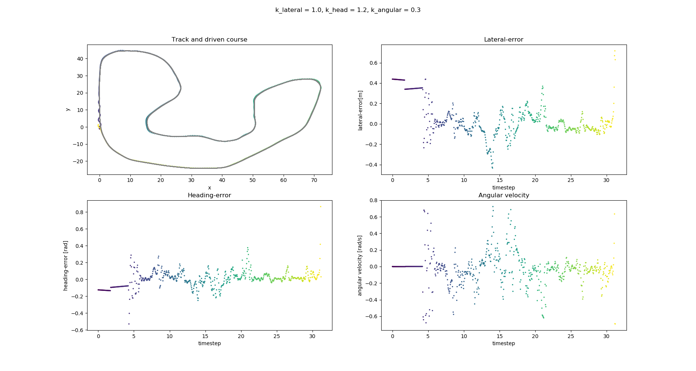

# Bumblebob Lateral Controller

## Overview

This package contains the Bumblebob kinematic lateral controller node. The control takes a given line and the car parameters as an input and controls the steering such that the car follows the line. 

The algorithm is based on the following assumptions:
 - we have a kinematic model and the car parameters are secondary
 - we only control the vehicle in lateral direction. The longitudinal needs a separate control. 

The lateral controller as it follows the given path.

**Author: Niklas Bubeck  
Maintainer: Niklas Bubeck, niklas.bubeck@octanes.de**

## Installation

#### External Dependencies

All external dependencies can be installed automatically via rosdep.

- [fssim] (Formula Student Simulation)
- [geometry_msgs] (ROS standard geometry messages)
- [dynamic_reconfigure] (ROS Package for configuration during runtime)
- [OpenCV] (OpenCV Library)
- [Eigen3] (Eigen3 Library)

### Unit Tests

Run the unit tests with

	catkin_make run_tests_bumblebob_lateral_controller

## Usage

Run the main node with

	roslaunch bumblebob_lateral_controller lat_kin.launch

For running the node with the simulation and a generated visualized line:

	roslaunch bumblebob_lateral_controller lat_kin_simulation.launch

In RVIZ: To visualize the generated path, add by topic and include the raceline_visualization Marker. 

While the controller is running, it collects the data in the scripts/kinematic_controller.csv. You can visualize the data with the given pythonscript scripts/display_csv_data.py. Dont forget to set the write_csv param in the config to True.

## Static Config Files

Config file config/config

* **config.yaml** Contains all parameters for the lateral controller, including gains and car parameters.

## Launch Files

* **lat_kin.launch:** Launches the lateral controller node and loads the parameters from the config.

* **lat_kin_simulation.launch:** Launches the lateral controller node, the fssim with adapter, a generated raceline.

## Nodes

### bumblebob_lateral_controller

Subscribes to IMU and Odometry Topics of the simulation and publishes the steering angle.

#### Subscribed Topics

* **`/bumblebob/raceline`** ([bumblebob_msgs/PointArray])

	The point array messages published by the bumblebob_navigation/scripts/simulation_line_node. The topic name is read from the config file.

* **`gazebo/model_states`** ([gazebo_msgs/ModelStates])

	The cone array messages published by the lidar cone detector. The topic name is read from the config file.

#### Published Topics

* **`/bumblebob/steering`** ([std_msgs/Float32])

	The estimated steering angle is published to this topic

#### Parameters

##### Static
* **`/publisher/steering`** (string, default: "/bumblebob/steering")

	The topic name of the published steering angle.

* **`/subscriber/states`** (string, default: "gazebo/model_states")

	The topic name of the incoming IMU and ODO states.

* **`/subscriber/raceline`** (string, default: "/bumblebob/cones/fused_cones")

    The topic name of the incoming raceline.

* **`/restrictions/highest_speed`** (string, default: "/bumblebob/cones/fused_cones")

    The restriction for the highest speed.

* **`/file`** (string, default: "../config/scripts/kinematic_controller.csv")

    Defines the csv file to save the data to

* **`/inits/write_csv`** (bool, default: True)

    Defines if the data should be saved

* **`/inits/debug_mode`** (bool, default: True)

    Defines if Debug outputs should be printed to the screen

* **`/loop_rate`** (int, default: 20)

    Defines loop rate of the ROS Node

##### Dynamic
* **`gains/lateral`** (int, default: 1.0)

	The lateral gain value.

* **`gains/heading`** (int, default: 1.2)

	The heading gain value.

* **`gains/delta_dot`** (int, default: 0.3)

    The change of steering gain value.

* **`/estimation_area/look_front`** (int, default: 10)

    The value that defines how many points to the front of the vehicle will be included to the calculations.

* **`/estimation_area/look_back`** (int, default: 10)

    The value that defines how many points to the back of the vehicle will be included to the calculations.

## TODOS
* Develop a gains map: As the controller is only lateral it needs different gains for different velocities. 
* Include more kinematic restrictions.
 
[bumblebob_msgs/ConeArray]: https://gitlab.cs.fau.de/high-octane-driverless/bumblebob/-/blob/develop/src/bumblebob_msgs/msg/ConeArray.msg
[tf2_ros]: http://wiki.ros.org/tf2_ros
[geometry_msgs]: http://wiki.ros.org/geometry_msgs
[dynamic_reconfigure]: http://wiki.ros.org/dynamic_reconfigure
[OpenCV]: https://opencv.org/
[Eigen3]: http://eigen.tuxfamily.org/index.php?title=Main_Page
[Fssim]: https://github.com/AMZ-Driverless/fssim