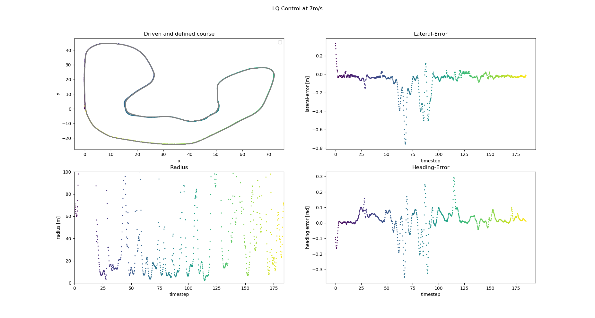

# Bumblebob Lateral Dynamic LQ Controller

## Overview

This package contains the Bumblebob dynamic lateral lq controller node. The controller takes a given line and the car parameters as an input and controls the steering such that the car follows the line. 

The algorithm is based on the following assumptions:
 - we have a dynamic vehicle model and the tire parameters of the car are very important
 - we only control the vehicle in lateral direction. The longitudinal needs a separate control. 
 - in the model, we neglect longitudinal forces. Therefore, we simplify the original dynamic model leading to linearization. Furthermore, a small angle assumption is done.
 - to calculate the best gains, we use a linear quadratic method.

**Author: Niklas Bubeck  
Maintainer: Niklas Bubeck, niklas.bubeck@octanes.de**

## Installation

#### External Dependencies

All external dependencies can be installed automatically via rosdep.

- [fssim] (Formula Student Simulation)
- [dynamic_reconfigure] (ROS Package for configuration during runtime)

### Unit Tests

Currently, there are no unit tests. Those will be delivered later

## Usage

Run the main node with

	roslaunch bumblebob_lateral_lq_controller lateral_lqr_controller_node.launch

For running the node with the simulation and a generated visualized line:

	roslaunch bumblebob_lateral_lq_controller launch_surroundings.launch

In RVIZ: To visualize the generated path, add by topic and include the raceline_visualization Marker. 

While the controller is running, it collects the data in the doc/lq_control_data.csv. You can visualize the data with the given pythonscript scripts/display_csv_data.py. Dont forget to set the write_csv param in the config to True.

Also, if you notice any weird behaviour, you can get more insights by enabling the debug_mode in the config file. Please also contact the maintainer/developer about it and have your lq_control_data.csv file ready as also some error outputs. 

## Static Config Files

Config file config/config

* **lq_config.yaml** Contains all parameters for the lateral controller, including gains and car parameters.

## Launch Files

* **lateral_lqr_controller_node.launch:** Launches the lateral LQ controller node and loads the parameters from the config.

* **launch_surroundings.launch:** Launches the lateral LQ controller node, the fssim with adapter, a generated raceline.

## Nodes

### bumblebob_lateral_lq_controller

Subscribes to IMU and Odometry Topics of the simulation and publishes the steering angle.

#### Subscribed Topics

* **`/bumblebob/raceline`** ([bumblebob_msgs/PointArray])

	The point array messages published by the bumblebob_navigation/scripts/simulation_line_node. The topic name is read from the config file.

* **`gazebo/model_states`** ([gazebo_msgs/ModelStates])

	The cone array messages published by the lidar cone detector. The topic name is read from the config file.

#### Published Topics

* **`/bumblebob/steering`** ([std_msgs/Float32])

	The estimated steering angle is published to this topic

#### Parameters

##### Static
* **`/publishers/steering_pub`** (string, default: "/bumblebob/steering")

	The topic name of the published steering angle.

* **`/subscribers/gazebo_sub`** (string, default: "gazebo/model_states")

	The topic name of the incoming IMU and ODO states.

* **`/subscribers/raceline_sub`** (string, default: "/bumblebob/raceline")

    The topic name of the incoming raceline.

* **`/car/inertia`** (float)

    The inertia values of the vehicle

* **`/car/kinematics`** (float)

    The kinematic values of the vehicle

* **`/car/tire`** (float)

    The tire values of the vehicle

* **`/file/path`** (string, default: "/../../scripts/lq_control_data.csv")

    Defines the csv file to save the data to

* **`/inits/write_csv`** (bool, default: True)

    Defines if the data should be saved

* **`/inits/debug_mode`** (bool, default: True)

    Defines if debug outputs should be printed to the screen

##### Dynamic
* **`control/Q/qn`** (int, default: q1 = 1, q2 = 0, q3 = 0, q4 = 0)

	The gain values.

* **`control/R`** (int, default: 1)

	The weight of the cost function

* **`gains/delta_dot`** (int, default: 0.3)

    The change of steering gain value.

* **`/control/lookahead`** (int, default: 20)

    The value that defines how many points to the front of the vehicle will be included to the calculations.

* **`/control/lookback`** (int, default: 5)

    The value that defines how many points to the back of the vehicle will be included to the calculations.

## TODOS
* Fix or improve the steady state eror of the forward part. The steady state error gets less if the vehicle drives faster. Driving slowly (< 3m/s), the error is also visible in the data.

## Known Problems 
* Sometimes Gazebo throws an error and breaks, leading the controller to pass out because it isnt given any data. 
 
[dynamic_reconfigure]: http://wiki.ros.org/dynamic_reconfigure
[Fssim]: https://github.com/AMZ-Driverless/fssim
