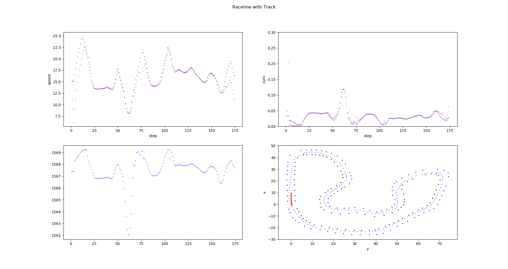

# Bumblebob Raceline Calculator

## Overview

This package contains the Bumblebob raceline calculator node. The Node takes the slam generated map and a reference line as inputs. It then optimizes the raceline as a costfunction of the laptime.

The algorithm is based on the following assumptions:
 - we have a kinematic model and the restriction are longitudinal forces
 - we find a global minimum of a given cost function as an iteratable process 

**Author: Niklas Bubeck  
Maintainer: Niklas Bubeck, niklas.bubeck@octanes.de**

#### External Dependencies

All external dependencies can be installed automatically via rosdep.

- [fssim] (Formula Student Simulation)
- [geometry_msgs] (ROS standard geometry messages)
- [std_msgs] (ROS standard messages)
- [dynamic_reconfigure] (ROS Package for configuration during runtime)
- [OpenCV] (OpenCV Library)
- [Eigen3] (Eigen3 Library)

### Unit Tests

There are no unit tests at the moment

## Usage

Run the main node with

	roslaunch bumblebob_raceline_calculator raceline_optimizer.launch 

If you want to test the Node you can also run the send_test_msg.cpp script with

	rosrun bumblebob_raceline_callator send_test_msg 

In RVIZ: To visualize the generated path, add by topic and include the raceline_visualization Marker. 

While the node is running, it can collect data to a specified file which you can set in the config/config.yaml file. You can visualize the data with the given pythonscript scripts/display_csv_data.py. Dont forget to set the write_csv param in the config to True.

## Static Config Files

Config file config/config

* **config.yaml** Contains all parameters for the velocity profile estimation, including some car parameters.

## Launch Files

* **raceline_optimizer.launch:** Launches the node and loads the parameters from the config.

## Nodes

### bumblebob_raceline_calculator

Subscribes to the generated map and reference line Topics and publishes an optimized raceline, as also a velocity profile.

#### Subscribed Topics

* **`/bumblebob/reference`** ([bumblebob_msgs/PointArray])

	The point array messages containing a reference path (the middle line) The topic name is read from the config file.

* **`bumblebob/map`** ([bumblebob_msgs/ConeArray])

	The cone array messages published by the slam node. The topic name is read from the config file.

#### Published Topics

* **`/bumblebob/raceline`** ([bumblebob_msgs/PointArray])

	The estimated raceline

* **`/bumblebob/velocity_profile`** ([std_msgs/Float64Multiarray])

	The estimated velocity at the certain position of the raceline

#### Parameters

##### Static
Please have a look at the config file itself.

##### Dynamic
There are no dynamic parameters.

## Future Work
* Include a Tire model and dynamic restrictions
  
## Linked Papers
[A Sequential Two-Step Algorithm for Fast Generation of Vehicle Racing Trajectories] 
 
[bumblebob_msgs/ConeArray]: https://gitlab.cs.fau.de/high-octane-driverless/bumblebob/-/blob/develop/src/bumblebob_msgs/msg/ConeArray.msg
[tf2_ros]: http://wiki.ros.org/tf2_ros
[geometry_msgs]: http://wiki.ros.org/geometry_msgs
[dynamic_reconfigure]: http://wiki.ros.org/dynamic_reconfigure
[OpenCV]: https://opencv.org/
[Eigen3]: http://eigen.tuxfamily.org/index.php?title=Main_Page
[Fssim]: https://github.com/AMZ-Driverless/fssim
[A Sequential Two-Step Algorithm for Fast Generation of Vehicle Racing Trajectories]: https://hom.mfk.uni-erlangen.de:8089/confluence/display/DVSOF/A+Sequential+Two-Step+Algorithm+for+Fast+Generation+of+Vehicle+Racing+Trajectories

